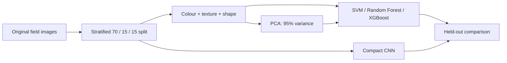

# Leaf Disease Classification: Handcrafted Features vs CNN

> A reproducible, leakage-aware benchmark for detecting leaf diseases in **bitter gourd, okra, pumpkin, and ridge gourd**.

[](#installation)
[](https://data.mendeley.com/datasets/2svdj3yyrk/1)
[](#dataset)

## Why this project?

Can carefully engineered image descriptors remain useful when compared with a CNN? This project answers that question with a controlled comparison of traditional machine learning and deep learning on field-acquired leaf images.

It intentionally avoids a common source of overly optimistic plant-disease results: **augmentation leakage**. The primary experiment uses only original images; pre-generated augmented copies are excluded before splitting.



## Dataset

The benchmark uses the [Leaf Image Dataset for Disease Detection in Bitter Gourd, Okra, Pumpkin, and Ridge Gourd](https://data.mendeley.com/datasets/2svdj3yyrk/1) (DOI: `10.17632/2svdj3yyrk.1`). It contains 4,568 expert-annotated original field images from the 2025 growing season in Bangladesh, spanning nine crop--condition classes.

| Crop | Classes |
| --- | --- |
| Bitter gourd | Anthracnose, Downy Mildew, Healthy |
| Okra | Cercospora Leaf Spot, Healthy |
| Pumpkin | Downy Mildew, Healthy |
| Ridge gourd | Downy Mildew, Healthy |

The Mendeley record also contains augmented copies. Download the archive, extract it, and point the command below to the directory containing the **original/raw** folders. Paths containing `augmented` are excluded automatically.

## Methods

| Component | Implementation |
| --- | --- |
| Colour descriptors | RGB/HSV moments and 16-bin channel histograms |
| Texture descriptors | Local Binary Pattern histogram; four-direction GLCM statistics |
| Shape descriptors | Saturation-based mask, largest contour, compactness, solidity, aspect ratio, Hu moments |
| Feature selection | Training-only standardization followed by PCA retaining 95% variance |
| Classical models | Linear, polynomial, and RBF SVMs; class-balanced Random Forest; XGBoost |
| Deep baseline | Three-block PyTorch CNN with batch normalization, dropout, and train-only flips/rotations |
| Evaluation | Stratified 70/15/15 train/validation/test split, seed 42; accuracy, macro-F1, balanced accuracy |

The best handcrafted model is labelled **competitive** only if its test macro-F1 is within 0.03 of the CNN. This decision rule is stated before evaluation; it is not adjusted after observing scores.

## Installation

```powershell
git clone https://github.com/ViswakowsikK2101/BitterGourd_Leaf_Disease_ML.git
cd BitterGourd_Leaf_Disease_ML
python -m pip install -r requirements.txt
```

The project uses CPU PyTorch by default; it automatically uses CUDA when available.

## Run the experiment

```powershell
python src/run_experiment.py `
  --data-root "C:\path\to\extracted\original_images" `
  --epochs 25
```

For a quick pipeline check:

```powershell
python src/run_experiment.py --data-root "C:\path\to\original_images" --max-per-class 30 --epochs 3
```

Use all original images and 25--40 epochs for the final reported experiment. Feature extraction, PCA, model fitting, plots, and report tables are all created by one command.

## Outputs

After a successful run, the following artifacts are created locally and intentionally ignored by Git:

```text
results/
├── metrics.csv                    # Comparable held-out metrics
├── latex_metrics_table.tex        # Imported by the LaTeX report
├── dataset_manifest.csv           # Exact image cohort and labels
├── handcrafted_features.npz       # Extracted descriptor matrix
├── cm_*.png                       # Normalized confusion matrices
├── cnn_history.csv
├── cnn_learning_curve.png
├── model_comparison.png          # Accuracy, precision, recall, F1 and ROC-AUC
└── training_time.png              # Fit-time comparison

models/
├── SVM_*.joblib
├── Random_Forest_*.joblib
├── XGBoost_*.joblib
└── tiny_cnn.pt
```

## Report

The `LabProjectReport.tex` report is based on the supplied academic template. It documents the dataset, leakage-safe protocol, descriptors, PCA design, models, cost/impact analysis, limitations, and future work. Once the experiment completes, `chapter3.tex` imports `results/latex_metrics_table.tex` automatically—there are no invented results.

Update student/course fields in [`mydata.tex`](mydata.tex), then compile with your preferred TeX distribution.

## Reproducibility and limitations

- Random seeds are fixed at 42 for Python, NumPy, and PyTorch.
- PCA is fit on the training partition only.
- The final test set is not used for early stopping or feature selection.
- Scores should be regenerated if data-folder layout, hardware, package versions, or model settings change.
- Field-image background and illumination variation can affect both segmentation-based descriptors and CNN generalization. External validation across locations and seasons remains necessary.

## Citation

```bibtex
@dataset{islam2025leaf,
  author = {Islam, Md Forhadul and Sutradhar, Imon and Rahman, Md Mizanur},
  title = {Leaf Image Dataset for Disease Detection in Bitter Gourd, Okra, Pumpkin, and Ridge Gourd},
  year = {2025},
  publisher = {Mendeley Data},
  version = {1},
  doi = {10.17632/2svdj3yyrk.1}
}
```

## Project structure

```text
.
├── src/run_experiment.py      # End-to-end benchmark
├── requirements.txt           # Python dependencies
├── LabProjectReport.tex       # Report entry point
├── chapter1.tex               # Background and objectives
├── chapter2.tex               # Methodology and design
├── chapter3.tex               # Generated-results discussion
├── references.tex             # Bibliography
└── assets/                    # Supplied report-template assets
```
